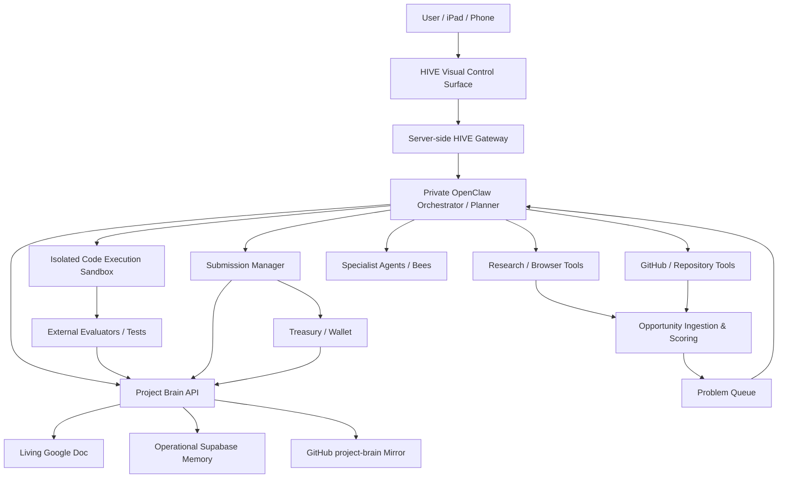

# Architecture

_Last updated: 2026-09-25_

## Target architecture



## HIVE boundary

HIVE is a separate public-safe frontend under `open-claw/apps/hive`. Its browser code must never hold reusable Supabase credentials, private database roles, wallet authority or privileged agent secrets.

The approved connection pattern is:

```text
browser HIVE
  -> same-origin /api/hive/* server routes
  -> authenticated server-to-server OpenClaw engine gateway
  -> private agent state + operational Supabase memory
```

The current read-only snapshot route is implemented. It falls back to explicitly labelled demo data until the private engine exposes an authenticated `/hive/snapshot` projection. Consequential commands should not be enabled until user authentication, permission checks, audit logging and CSRF/action safeguards are designed.

## Current HIVE implementation

- Next.js + React control surface
- React Three Fiber + Three.js scene
- custom GLSL deformation shaders
- GSAP + ScrollTrigger depth and scroll motion
- accessible simple/text fallbacks
- comfort modes including reduced/no motion
- large interaction targets and keyboard focus states
- dedicated Today, Work, Bees, Radar, Money, Brain, Build, Lab, Security and Me views
- draft pull request #8 contains the current implementation

## Current vs target

### Current predecessor
- Python package in `sophiamaybea/open-claw`
- local Ollama client
- JSON/JSONL memory
- model-generated reflection score
- basic prompt evolution
- skill text/code stored in memory
- recursive-improvement note written for human merge

### Target
- persistent cloud execution
- real typed tool router
- sandboxed code/test loop
- source-grounded research
- capability/opportunity matching
- external correctness evaluators
- failure-aware planning
- Project Brain API
- knowledge graph / semantic retrieval
- permission-aware submissions
- controlled treasury/wallet
- complete audit trail
- HIVE as the primary human control surface for visibility, approvals and interruption

## Key principle

Self-improvement is only promoted when external evidence shows it improved task performance. Model self-scoring alone is not sufficient.
