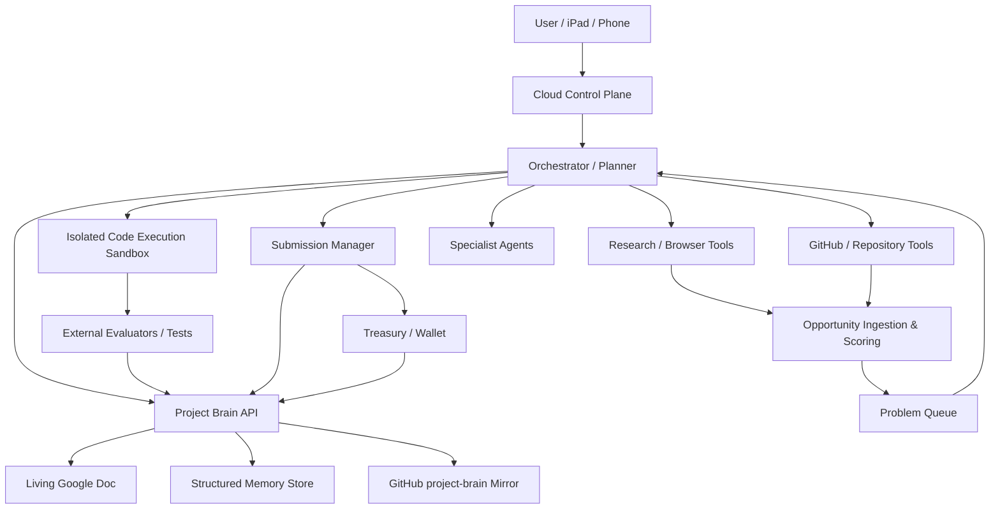

# Architecture

_Last updated: 2026-09-25_

## Target architecture

## Current vs target

### Current predecessor
- Python package in `sophiamaybea/open-claw`
- local Ollama client
- JSON/JSONL memory
- model-generated reflection score
- basic prompt evolution
- skill text/code stored in memory
- recursive-improvement note written for human merge

### Target
- persistent cloud execution
- real typed tool router
- sandboxed code/test loop
- source-grounded research
- capability/opportunity matching
- external correctness evaluators
- failure-aware planning
- Project Brain API
- knowledge graph / semantic retrieval
- permission-aware submissions
- controlled treasury/wallet
- complete audit trail

## Key principle

Self-improvement is only promoted when external evidence shows it improved task performance. Model self-scoring alone is not sufficient.
